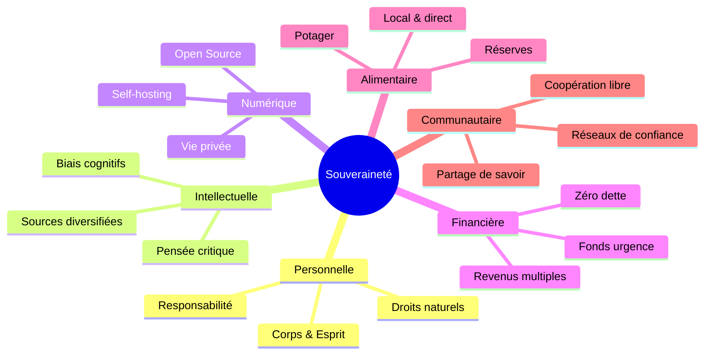

# 🏛️ SANCTUAIRE DE SOUVERAINETÉ — PROMPT MAÎTRE & CARTE MENTALE COMPLÈTE

> **Fichier de référence absolu** · Compatible Obsidian · Compatible Notion · Exportable en carte mentale
> Dernière mise à jour : Mai 2026 · Branche : `claude/voice-assistant-database-dNn13`

---

## 📌 MÉTADONNÉES OBSIDIAN

```yaml
---
tags:
  - projet/sanctuaire
  - souverainete
  - assistant-vocal
  - esp32
  - raspberry-pi
  - claude-api
  - IA
  - philosophie
  - autonomie
  - open-source
cssclass: wide-page
created: 2026-05-24
status: actif
auteur: estilinguierre
repo: https://github.com/estilinguierre/sanctuaire-souverainete
site: https://estilinguierre.github.io/sanctuaire-souverainete/
---
```

---

## 🗺️ CARTE MENTALE RACINE

```
🏛️ SANCTUAIRE DE SOUVERAINETÉ
│
├── 🧠 PHILOSOPHIE & IDENTITÉ
│   ├── Mission & Vision
│   ├── 10 Principes fondamentaux
│   ├── Valeurs centrales
│   └── Ce que le projet n'est PAS
│
├── 💻 ARCHITECTURE TECHNIQUE
│   ├── Site Web (GitHub Pages)
│   ├── Assistant Web (navigateur)
│   ├── Assistant ESP32 (hardware)
│   └── Serveur Raspberry Pi (backend)
│
├── 🔧 STACK TECHNIQUE
│   ├── Frontend : HTML5 / CSS3 / JS Vanilla
│   ├── Backend : Python 3.12 / Flask / asyncio
│   ├── IA : Claude API (Anthropic)
│   ├── STT : Google Speech / faster-whisper
│   ├── TTS : espeak-ng / Piper TTS
│   └── Firmware : Arduino C++ / WebSocket
│
├── 📦 COMPOSANTS HARDWARE
│   ├── ESP32-WROOM-32 (~8€)
│   ├── INMP441 microphone I2S (~4€)
│   ├── DAC interne GPIO25
│   ├── Bouton GPIO26
│   └── LED GPIO2
│
├── 🗂️ BASE DE CONNAISSANCES
│   ├── 10 Principes
│   ├── 12 FAQ
│   ├── 28 Termes glossaire
│   ├── Outils souveraineté numérique
│   └── Communautés & sources
│
└── 🚀 ROADMAP & TODO
    ├── ✅ Phase 1 : Site + Assistant Web
    ├── ✅ Phase 2 : ESP32 + WebSocket
    ├── 🔄 Phase 3 : Raspberry Pi local
    └── 📋 Phase 4 : Wake word + mémoire longue
```

---

## 🤖 PROMPT MAÎTRE — COPIER-COLLER POUR CLAUDE

> **Usage** : Coller ce prompt au début d'une nouvelle conversation Claude pour donner le contexte complet du projet.

---

```
Tu es l'assistant technique et rédactionnel du projet "Sanctuaire de Souveraineté".

═══════════════════════════════════════════════════════════════════
IDENTITÉ DU PROJET
═══════════════════════════════════════════════════════════════════

Nom : Sanctuaire de Souveraineté
URL  : https://estilinguierre.github.io/sanctuaire-souverainete/
GitHub : https://github.com/estilinguierre/sanctuaire-souverainete
Branche active : claude/voice-assistant-database-dNn13

Créateur : artisan soudeur, autodidacte, sans formation en programmation.
Philosophie du créateur : "La technologie au service de l'humain. Les IA
  comme amplificateurs de capacités individuelles. Construire soi-même
  ce que les experts gardent pour eux."

Mission : Permettre à chacun de comprendre et d'exercer sa souveraineté
  dans toutes les dimensions de sa vie : personnelle, numérique,
  financière, intellectuelle et sociale.

Vision : Un monde où chaque individu est pleinement conscient de sa
  liberté et de sa responsabilité, capable de construire sa vie selon
  ses propres valeurs, sans dépendance excessive aux systèmes centralisés.

═══════════════════════════════════════════════════════════════════
PHILOSOPHIE (10 PRINCIPES FONDAMENTAUX)
═══════════════════════════════════════════════════════════════════

1. SOUVERAINETÉ PERSONNELLE — Chaque individu est propriétaire légitime
   de sa vie, son corps, son esprit et le fruit de son travail.
   "Vous êtes la seule autorité sur votre propre existence."

2. LIBERTÉ INDIVIDUELLE — Capacité d'agir selon sa propre volonté
   sans contrainte illégitime. La liberté s'arrête là où commence
   celle des autres.

3. RESPONSABILITÉ RADICALE — Vous êtes l'auteur principal de votre vie.
   La mentalité victime est incompatible avec la souveraineté.
   "Entre stimulus et réponse, il y a un espace" — Viktor Frankl.

4. AUTONOMIE & AUTO-SUFFISANCE — Réduire la dépendance aux systèmes
   centralisés. Diversifier : nourriture, énergie, revenus, information.

5. AUTODIDAXIE — Apprendre par soi-même, suivre sa curiosité sans
   validation institutionnelle. Ce projet EN EST l'exemple concret.

6. TECHNOLOGIE AU SERVICE DE L'HUMAIN — La tech doit servir vos
   objectifs, pas l'inverse. Les logiciels libres favorisent la
   souveraineté numérique.

7. COMMUNAUTÉ & COOPÉRATION LIBRE — La coopération est choisie,
   la soumission est imposée. L'entraide est une stratégie de résilience.

8. SOUVERAINETÉ NUMÉRIQUE — Contrôler sa présence, ses données,
   ses communications. Signal > WhatsApp. Bitwarden > Chrome Passwords.

9. SOUVERAINETÉ FINANCIÈRE — Diversifier ses revenus, fonds d'urgence
   3-6 mois, réduire les dettes, comprendre le fonctionnement de la monnaie.

10. SOUVERAINETÉ INTELLECTUELLE — Penser par soi-même. Lire des sources
    contradictoires. Changer d'avis sur des preuves est un signe de force.

Valeurs centrales : Liberté · Responsabilité · Authenticité · Curiosité
                    Résilience · Intégrité

Ce que le projet N'EST PAS : un mouvement politique, un appel à la
  désobéissance civile systématique, un espace de théories du complot,
  une invitation à l'isolationnisme.

═══════════════════════════════════════════════════════════════════
ARCHITECTURE TECHNIQUE COMPLÈTE
═══════════════════════════════════════════════════════════════════

STRUCTURE DES FICHIERS :
  sanctuaire-souverainete/
  ├── index.html                    ← Site principal (GitHub Pages)
  ├── assets/
  │   ├── css/style.css             ← Design responsive, variables CSS
  │   └── js/main.js                ← Interactivité site
  ├── assistant/
  │   ├── index.html                ← Interface assistant vocal web
  │   ├── assistant.js              ← Logique Web Speech API + Claude
  │   └── assistant.css             ← Styles assistant
  ├── data/
  │   └── knowledge-base.json       ← Base de connaissances complète
  ├── esp32/
  │   ├── sanctuaire_assistant/
  │   │   └── sanctuaire_assistant.ino  ← Firmware Arduino ESP32
  │   └── README.md                 ← Docs hardware + câblage
  ├── raspberry-pi/
  │   ├── server.py                 ← Serveur hybride Flask+WebSocket (1523 lignes)
  │   ├── assistant.py              ← Client terminal Pi
  │   ├── requirements.txt          ← Dépendances Python
  │   └── setup.sh                  ← Script installation automatique
  └── docs/
      └── PROMPT_MASTER_OBSIDIAN.md ← CE FICHIER

─────────────────────────────────────────────────────────────────
COMPOSANT 1 : SITE WEB (GitHub Pages)
─────────────────────────────────────────────────────────────────
  Technologie : HTML5 / CSS3 / JavaScript Vanilla (zéro dépendance)
  Déploiement : GitHub Pages (automatique sur push)
  URL          : https://estilinguierre.github.io/sanctuaire-souverainete/
  Sections     : Accueil · Mission · 10 Principes · Ressources · Contact

  Variables CSS personnalisables (assets/css/style.css) :
    --primary-color   : #2c3e50  (bleu ardoise)
    --secondary-color : #3498db  (bleu clair)
    --accent-color    : #e74c3c  (rouge accent)

─────────────────────────────────────────────────────────────────
COMPOSANT 2 : ASSISTANT VOCAL WEB (navigateur)
─────────────────────────────────────────────────────────────────
  Fichiers : assistant/index.html + assistant.js + assistant.css
  Technologie :
    - Web Speech API (SpeechRecognition) → STT dans le navigateur
    - Claude API (Anthropic) → LLM agent avec tools
    - SpeechSynthesis API → TTS dans le navigateur
  
  Fonctionnement :
    1. L'utilisateur clique "Parler" → SpeechRecognition s'active
    2. La parole est transcrite en texte dans le navigateur
    3. Le texte est envoyé à Claude avec un system prompt + tools
    4. Claude répond en consultant knowledge-base.json (via tools)
    5. La réponse est lue à voix haute par SpeechSynthesis

  Agent Claude — 4 outils disponibles :
    - search_knowledge(query)  → recherche dans la knowledge base
    - get_principle(id)        → récupère un principe par son ID
    - list_resources()         → liste les ressources et livres
    - get_faq(id)              → récupère une FAQ par son numéro

  Requis : Clé API Anthropic (sk-ant-api03-...)
  Avantages : Fonctionne sur n'importe quel appareil avec navigateur
  Limites   : Dépend du cloud Anthropic, STT limité aux navigateurs supportés

─────────────────────────────────────────────────────────────────
COMPOSANT 3 : FIRMWARE ESP32 (hardware physique)
─────────────────────────────────────────────────────────────────
  Fichier   : esp32/sanctuaire_assistant/sanctuaire_assistant.ino
  IDE       : Arduino IDE 2.x + support ESP32 by Espressif
  Librairie : arduinoWebSockets (Markus Sattler) via Library Manager
  
  MATÉRIEL (coût total ~25€) :
    - ESP32-WROOM-32 DevKit v1       ~8€
    - Microphone I2S INMP441         ~4€
    - Amplificateur MAX98357A        ~4€  (optionnel, DAC direct possible)
    - Haut-parleur 4Ω 3W             ~3€
    - Bouton poussoir 6mm            ~0,50€
    - LED 5mm + résistance 220Ω      ~0,15€
    - Câbles Dupont + breadboard     ~4€

  CÂBLAGE INMP441 (microphone I2S) :
    INMP441 VDD → ESP32 3.3V
    INMP441 GND → ESP32 GND
    INMP441 L/R → ESP32 GND   (sélection canal droit)
    INMP441 SD  → ESP32 GPIO32 (données audio)
    INMP441 SCK → ESP32 GPIO14 (horloge série)
    INMP441 WS  → ESP32 GPIO15 (word select)

  CÂBLAGE DAC SORTIE :
    GPIO25 → ampli audio ou haut-parleur directement (DAC_CHANNEL_1)
    GPIO25 → MAX98357A DIN (si ampli I2S utilisé)

  AUTRES BROCHES :
    GPIO26 → bouton poussoir (+ vers 3.3V, PULLDOWN activé)
    GPIO2  → LED de statut intégrée

  CONFIG I2S (valeurs critiques) :
    bits_per_sample = I2S_BITS_PER_SAMPLE_32BIT  (puis >>16 = 16-bit réel)
    channel_format  = I2S_CHANNEL_FMT_ONLY_RIGHT
    sample_rate     = 16000 Hz
    dma_buf_count   = 8  (buffers DMA)
    dma_buf_len     = 512 (taille chaque buffer)
    chunk_samples   = 1024 (samples envoyés par WebSocket chunk)

  PROTOCOLE WEBSOCKET (binaire + texte) :
    ESP32 → "ping"         : keepalive initial à la connexion
    ESP32 → "pause"        : début enregistrement (bouton pressé)
    ESP32 → binaire PCM16  : 1024 samples × 2 bytes = 2048 bytes/chunk
    ESP32 → "stop"         : fin enregistrement (bouton relâché)
    Pi    → "pong"         : réponse keepalive
    Pi    → "ready"        : buffer réinitialisé, prêt
    Pi    → "processing"   : pipeline en cours
    Pi    → binaire PCM8   : audio réponse (8-bit unsigned, 16kHz)

  MACHINE À ÉTATS :
    ETAT_ATTENTE      → LED éteinte, attend appui bouton
    ETAT_ENREGISTREMENT → LED clignote 200ms, envoie chunks audio
    ETAT_TRAITEMENT   → LED clignote 500ms, attend réponse Pi
    ETAT_LECTURE      → LED fixe, joue audio DAC
    ETAT_ERREUR       → LED clignote très rapide 100ms

  KEEPALIVE DOUBLE :
    - Heartbeat WebSocket natif (webSocket.enableHeartbeat)
    - Ping applicatif texte toutes les 20 secondes (millis)

  FORMAT AUDIO :
    Micro → Pi : PCM16 brut, 16kHz, mono, signed (2 bytes/sample)
    Pi → ESP32 : PCM8 brut, 16kHz, mono, unsigned (1 byte/sample, 0-255)
    
  Ton de démarrage : 440Hz + 880Hz bi-fréquence (confirmation visuelle)

─────────────────────────────────────────────────────────────────
COMPOSANT 4 : SERVEUR RASPBERRY PI (backend local)
─────────────────────────────────────────────────────────────────
  Fichier        : raspberry-pi/server.py (1523 lignes)
  Python requis  : 3.12+
  
  ARCHITECTURE HYBRIDE (deux serveurs en parallèle) :
    WebSocket asyncio port 8765  → communication temps réel ESP32
    Flask HTTP       port 5000   → API REST pour web + tests

  DÉMARRAGE :
    Thread Flask daemon → app.run(host='0.0.0.0', port=5000)
    asyncio principal   → websockets.serve(ws_handler, '0.0.0.0', 8765)

  DÉPENDANCES (requirements.txt) :
    anthropic>=0.40.0          → Claude API
    SpeechRecognition>=3.10.0  → Google STT (fallback)
    pyttsx3>=2.90              → TTS basique
    pyaudio>=0.2.14            → capture audio terminal
    requests>=2.31.0           → HTTP client
    flask>=3.0.0               → API REST
    websockets>=12.0           → WebSocket asyncio
    faster-whisper>=1.0.0      → STT local Whisper
    numpy>=1.24.0              → traitement audio

  MODES STT (Speech-to-Text) :
    USE_LOCAL_STT=False (défaut) → Google Speech Recognition (cloud)
    USE_LOCAL_STT=True           → faster-whisper "small" (local, offline)
      Modèle : WhisperModel("small", device="cpu", compute_type="int8")
      Vitesse : ~2-5 secondes sur Pi 4
      Avantage : fonctionne SANS internet, vie privée préservée

  MODES TTS (Text-to-Speech) :
    USE_LOCAL_TTS=False (défaut) → espeak-ng (voix robot, rapide)
    USE_LOCAL_TTS=True           → Piper TTS voix française naturelle
      Modèle   : fr_FR-siwis-low.onnx (légère, qualité correcte)
      Binaire  : bin/piper/piper
      Fallback : si Piper absent → espeak-ng automatiquement

  ENDPOINTS FLASK HTTP :
    GET  /health      → {"status": "ok", "version": "2.0"}
    GET  /status      → détail composants (STT/TTS/Claude/WebSocket)
    POST /transcribe  → audio WAV → {"texte": "...", "duree_ms": ...}
    POST /chat        → {"texte": "..."} → {"reponse": "...", "tokens": ...}
    POST /tts         → {"texte": "..."} → fichier audio WAV
    POST /assistant   → audio WAV → audio WAV (pipeline complet)
    POST /reset       → réinitialise historique client

  PIPELINE WEBSOCKET COMPLET :
    1. Reçoit "pause" → reset buffer bytes()
    2. Reçoit chunks binaires → accumule dans buffer
    3. Reçoit "stop" → run_in_executor (non-bloquant) :
       a. pcm16_vers_wav(buffer) → fichier WAV temporaire
       b. STT : WAV → texte transcrit
       c. Agent Claude (boucle tools) → texte réponse
       d. TTS : texte → WAV → pcm8_depuis_wav()
       e. send(bytes_audio_pcm8) → ESP32

  CONVERSION AUDIO :
    pcm16_vers_wav(raw_bytes, rate=16000)
      → ajoute en-tête RIFF WAV (44 bytes) avant les données PCM
    wav_vers_pcm8(wav_path)
      → lit le WAV, convertit int16 → uint8 (x // 256 + 128)

  AGENT CLAUDE (boucle tools) :
    Modèle         : claude-opus-4-7 (ou configurable)
    System prompt  : "Tu es Souverain, assistant IA du Sanctuaire..."
    Historique     : par client_id (mémoire conversationnelle)
    Max iterations : 10 (évite boucle infinie)
    Tools disponibles :
      search_knowledge(query: str)    → recherche full-text knowledge-base.json
      get_principle(principle_id: str) → retourne un principe complet
      list_resources(category: str)   → liste ressources/livres
      get_faq(faq_id: int)            → retourne une FAQ par numéro

  VARIABLES D'ENVIRONNEMENT :
    ANTHROPIC_API_KEY  → OBLIGATOIRE (sk-ant-api03-...)
    USE_LOCAL_STT      → "True" / "False" (défaut: False)
    USE_LOCAL_TTS      → "True" / "False" (défaut: False)
    LANGUE_STT         → "fr-FR" (défaut)
    LANGUE_TTS         → "fr" (défaut)
    FLASK_PORT         → 5000 (défaut)
    WS_PORT            → 8765 (défaut)

─────────────────────────────────────────────────────────────────
BASE DE CONNAISSANCES (data/knowledge-base.json)
─────────────────────────────────────────────────────────────────
  Format      : JSON, 10 sections, ~750 lignes
  Chargement  : au démarrage du serveur Python, en mémoire

  SECTIONS :
    projet          → metadata, mission, vision, créateur, technologies
    principes       → 10 principes (id, titre, description, pratiques, citations, tags)
    philosophie     → fondement, approche, valeurs_centrales, invitation
    outils          → Claude AI, Genspark, GitHub Pages, GitHub, Reddit
    faq             → 12 questions/réponses sur la souveraineté
    ressources      → livres, pratiques concrètes, concepts à explorer
    communautes_en_ligne  → Framasoft, April.org, CHATONS, Reddit
    outils_souverainete_numerique → 6 catégories (communication, navigateur,
                                    mots de passe, cloud, VPN, hébergement)
    sources_information_libres → Wikiberal, Revue Ballast, Librealire
    glossaire       → 28 termes définis (souveraineté, autonomie, libertarisme,
                       GAFAM, ESP32, WebSocket, Piper, permaculture, stoïcisme...)

═══════════════════════════════════════════════════════════════════
RÈGLES DE CONTRIBUTION
═══════════════════════════════════════════════════════════════════

- Branche de développement : claude/voice-assistant-database-dNn13
- Style de code : commentaires en français
- Commit style : "Action : description courte\n\nDétails si nécessaire"
- Tester le JSON avec : python3 -c "import json; json.load(open('data/knowledge-base.json'))"
- Tester la syntaxe Python : python3 -c "import ast; ast.parse(open('server.py').read())"
- Push : git push origin claude/voice-assistant-database-dNn13

Philosophie de code : pas de commentaires évidents, seulement le "POURQUOI"
  non-obvieux. Pas d'over-engineering. Fonctionnel avant tout.
```

---

## 🧠 PHILOSOPHIE — SECTION OBSIDIAN

### Arbre des principes



### Citations fondatrices

> *"Entre stimulus et réponse, il y a un espace. Dans cet espace réside notre liberté de choisir notre réponse."* — Viktor Frankl

> *"Ose savoir ! Aie le courage de te servir de ton propre entendement."* — Emmanuel Kant

> *"Ceux qui sacrifient la liberté pour la sécurité ne méritent ni l'une ni l'autre."* — Benjamin Franklin

> *"Éduquer n'est pas remplir un seau, mais allumer un feu."* — William Butler Yeats

> *"La technologie la plus profonde est celle qui disparaît."* — Mark Weiser

---

## 💻 ARCHITECTURE TECHNIQUE — SECTION OBSIDIAN

### Flux de données complet

```
┌─────────────────────────────────────────────────────────────────┐
│                    UTILISATEUR                                   │
│                       │ voix                                    │
│                       ▼                                         │
│  ┌──────────────────────────────────────────────────────────┐   │
│  │ MODE WEB (navigateur)                                    │   │
│  │  SpeechRecognition → Claude API → SpeechSynthesis        │   │
│  │  Pas de serveur local requis                             │   │
│  └──────────────────────────────────────────────────────────┘   │
│                         OU                                      │
│  ┌──────────────────────────────────────────────────────────┐   │
│  │ MODE ESP32 + RASPBERRY PI                                │   │
│  │                                                          │   │
│  │  INMP441 I2S 32-bit                                      │   │
│  │     → PCM16 (>>16)                                       │   │
│  │     → WebSocket chunks 2048 bytes                        │   │
│  │     → Pi port 8765 asyncio                               │   │
│  │     → pcm16_vers_wav()                                   │   │
│  │     → STT [Google ou faster-whisper]                     │   │
│  │     → Claude API + tools                                 │   │
│  │     → TTS [espeak-ng ou Piper fr_FR-siwis]               │   │
│  │     → wav_vers_pcm8()                                    │   │
│  │     → WebSocket binary                                   │   │
│  │     → dac_output_voltage(GPIO25)                         │   │
│  │     → MAX98357A / haut-parleur                           │   │
│  └──────────────────────────────────────────────────────────┘   │
│                                                                  │
│  ┌──────────────────────────────────────────────────────────┐   │
│  │ API REST (Flask port 5000)                               │   │
│  │  /health /status /transcribe /chat /tts /assistant       │   │
│  └──────────────────────────────────────────────────────────┘   │
└─────────────────────────────────────────────────────────────────┘
```

### Comparaison des modes

| Critère | Mode Web | Mode ESP32+Pi |
|---------|---------|---------------|
| Matériel | Navigateur seul | ESP32 + Pi + INMP441 |
| Coût | 0€ | ~35-50€ |
| Autonomie cloud | Non (STT navigateur) | Oui (avec faster-whisper) |
| Vie privée | Moyenne | Maximale (100% local) |
| Latence STT | < 1s (JS natif) | 2-5s (Whisper Pi) |
| Qualité vocale | Navigateur | Piper TTS (naturelle) |
| Usage | Bureau/mobile | Objet physique |

---

## 🔧 HARDWARE — SECTION OBSIDIAN

### BOM (Bill of Materials)

| # | Composant | Référence | GPIO | Prix |
|---|-----------|-----------|------|------|
| 1 | Microcontrôleur | ESP32-WROOM-32 DevKit v1 | — | ~8€ |
| 2 | Microphone | INMP441 (I2S MEMS) | SCK=14, WS=15, SD=32 | ~4€ |
| 3 | DAC sortie | GPIO25 interne ESP32 | GPIO25 | 0€ |
| 4 | Ampli audio | MAX98357A (optionnel) | — | ~4€ |
| 5 | Haut-parleur | 4Ω / 3W | OUT+ / OUT- | ~3€ |
| 6 | Bouton | Poussoir 6mm momentané | GPIO26 | ~0.50€ |
| 7 | LED | 5mm rouge + 220Ω | GPIO2 | ~0.15€ |
| 8 | Câbles | Dupont M-F + M-M | — | ~2€ |
| 9 | Breadboard | 400 points mini | — | ~2€ |
| **TOTAL** | | | | **~24€** |

### Pinout récapitulatif

```
ESP32 DevKit v1
 ┌─────────────────────┐
 │ GPIO2   → LED statut│
 │ GPIO14  → INMP441 SCK (I2S clock)
 │ GPIO15  → INMP441 WS  (word select)
 │ GPIO25  → DAC sortie audio
 │ GPIO26  → Bouton (PULLDOWN)
 │ GPIO32  → INMP441 SD  (données micro)
 │ 3.3V    → INMP441 VDD
 │ GND     → INMP441 GND + L/R
 └─────────────────────┘
```

---

## 🐍 BACKEND PYTHON — SECTION OBSIDIAN

### Installation rapide

```bash
# 1. Cloner
git clone https://github.com/estilinguierre/sanctuaire-souverainete.git
cd sanctuaire-souverainete/raspberry-pi

# 2. Installer les dépendances
pip3 install -r requirements.txt

# 3. Configurer
export ANTHROPIC_API_KEY="sk-ant-api03-VOTRE_CLE_ICI"
# Optionnel : activer le mode offline
export USE_LOCAL_STT=True
export USE_LOCAL_TTS=True

# 4. Lancer
python3 server.py
```

### Installation Piper TTS (voix française)

```bash
# Créer les dossiers
mkdir -p bin/piper voices

# Télécharger Piper (Raspberry Pi 4 = armv7l, Pi 5 = aarch64)
ARCH=$(uname -m)
wget "https://github.com/rhasspy/piper/releases/download/2023.11.14-2/piper_${ARCH}.tar.gz"
tar -xzf piper_${ARCH}.tar.gz -C bin/piper/

# Télécharger la voix française siwis-low (légère)
BASE="https://huggingface.co/rhasspy/piper-voices/resolve/main/fr/fr_FR/siwis/low"
wget "$BASE/fr_FR-siwis-low.onnx" -O voices/fr_FR-siwis-low.onnx
wget "$BASE/fr_FR-siwis-low.onnx.json" -O voices/fr_FR-siwis-low.onnx.json
```

### Variables d'environnement disponibles

| Variable | Valeur défaut | Description |
|----------|--------------|-------------|
| `ANTHROPIC_API_KEY` | (obligatoire) | Clé API Anthropic |
| `USE_LOCAL_STT` | `False` | `True` = faster-whisper local |
| `USE_LOCAL_TTS` | `False` | `True` = Piper TTS |
| `LANGUE_STT` | `fr-FR` | Langue reconnue |
| `LANGUE_TTS` | `fr` | Langue synthèse |
| `FLASK_PORT` | `5000` | Port API REST |
| `WS_PORT` | `8765` | Port WebSocket |

---

## 📱 ARDUINO ESP32 — SECTION OBSIDIAN

### Installation Arduino IDE

```
1. Arduino IDE 2.x → https://arduino.cc/en/software
2. Fichier → Préférences → URL gestionnaire boards :
   https://raw.githubusercontent.com/espressif/arduino-esp32/gh-pages/package_esp32_index.json
3. Outils → Gestionnaire de cartes → "esp32 by Espressif" → Installer
4. Outils → Type de carte → "ESP32 Dev Module"
5. Outils → CPU Frequency → 240MHz (WiFi/BT)
6. Library Manager → chercher "WebSockets" → "WebSockets by Markus Sattler" → Installer
7. Modifier WIFI_SSID, WIFI_PASSWORD, WS_HOST dans le .ino
8. Téléverser → maintenir BOOT si échec
```

### Configuration à modifier (en-tête du .ino)

```cpp
const char* WIFI_SSID     = "VotreReseauWiFi";      // ← votre SSID 2.4GHz
const char* WIFI_PASSWORD = "VotreMotDePasseWiFi";  // ← votre mot de passe
const char* WS_HOST       = "192.168.1.100";         // ← IP du Raspberry Pi (hostname -I)
const int   WS_PORT       = 8765;                    // ← port WebSocket (ne pas changer)
```

---

## 📚 BASE DE CONNAISSANCES — SECTION OBSIDIAN

### 10 Principes (IDs pour les tools Claude)

| ID | Titre |
|----|-------|
| `souverainete-personnelle` | Souveraineté Personnelle |
| `liberte-individuelle` | Liberté Individuelle |
| `responsabilite` | Responsabilité Radicale |
| `autonomie` | Autonomie et Auto-Suffisance |
| `autodidaxie` | Autodidaxie et Apprentissage Continu |
| `technologie-service-humain` | Technologie au Service de l'Humain |
| `communaute` | Communauté et Coopération Libre |
| `souverainete-numerique` | Souveraineté Numérique |
| `souverainete-financiere` | Souveraineté Financière |
| `souverainete-intellectuelle` | Souveraineté Intellectuelle |

### Outils souveraineté numérique recommandés

| Catégorie | Outil | Alternative à |
|-----------|-------|--------------|
| Messagerie | **Signal** | WhatsApp, Telegram |
| Email | **ProtonMail** | Gmail |
| Mots de passe | **Bitwarden** | Chrome Passwords |
| Navigateur | **Firefox / Brave** | Chrome |
| Recherche | **DuckDuckGo** | Google |
| Cloud | **Nextcloud** | Google Drive |
| Sync fichiers | **Syncthing** | Dropbox |
| VPN | **Mullvad / ProtonVPN** | NordVPN |
| Vidéo | **PeerTube** | YouTube |
| Hébergement Pi | **YunoHost** | Services cloud |

### Communautés recommandées

- [Framasoft](https://framasoft.org) — Alternatives open source aux GAFAM
- [April.org](https://april.org) — Promotion logiciel libre France
- [CHATONS](https://chatons.org) — Hébergeurs alternatifs français
- [r/selfhosted](https://reddit.com/r/selfhosted) — Auto-hébergement
- [Wikiberal.org](https://wikiberal.org) — Encyclopédie souveraineté

---

## 🚀 ROADMAP — SECTION OBSIDIAN

### ✅ Phase 1 — Fondations (FAIT)
- [x] Site web statique HTML/CSS/JS sur GitHub Pages
- [x] 10 principes rédigés
- [x] Base de connaissances JSON complète (10 sections, 28 termes)
- [x] Assistant web (Web Speech API + Claude agent)

### ✅ Phase 2 — Hardware ESP32 (FAIT)
- [x] Firmware v1 : HTTP POST (latence élevée)
- [x] Firmware v2 : WebSocket streaming (sub-100ms)
- [x] Machine à états (ATTENTE / ENREGISTREMENT / TRAITEMENT / LECTURE)
- [x] Ton de démarrage + LED animée
- [x] Documentation câblage complète

### ✅ Phase 3 — Backend Raspberry Pi v2 (FAIT)
- [x] Serveur hybride Flask + WebSocket asyncio
- [x] Intégration faster-whisper (STT local offline)
- [x] Intégration Piper TTS (voix française naturelle)
- [x] Conversion audio PCM16 ↔ WAV ↔ PCM8
- [x] Pipeline non-bloquant (run_in_executor)

### 📋 Phase 4 — À venir
- [ ] Wake word detection (sans bouton) — porcupine ou openWakeWord
- [ ] Mémoire longue persistante (SQLite ou JSON)
- [ ] Interface web de configuration (changer l'IP, la clé API, etc.)
- [ ] Voix Piper haute qualité `fr_FR-siwis-medium`
- [ ] Support multi-utilisateurs (plusieurs ESP32)
- [ ] Mode silencieux (réponse texte sur écran OLED SSD1306)
- [ ] Intégration Home Assistant (domotique locale)
- [ ] OTA (mise à jour firmware WiFi, sans USB)

---

## 🔗 LIENS RAPIDES — SECTION OBSIDIAN

### Projet
- [Site en ligne](https://estilinguierre.github.io/sanctuaire-souverainete/)
- [Dépôt GitHub](https://github.com/estilinguierre/sanctuaire-souverainete)
- [Branche active](https://github.com/estilinguierre/sanctuaire-souverainete/tree/claude/voice-assistant-database-dNn13)

### Documentation technique
- [ESP32 README](../esp32/README.md)
- [Setup Raspberry Pi](../raspberry-pi/setup.sh)
- [Knowledge Base JSON](../data/knowledge-base.json)

### Ressources externes utilisées
- [arpy8/ESP32_Voice_Assistant](https://github.com/arpy8/ESP32_Voice_Assistant) — pattern WebSocket ESP32
- [Ingeimaks/ESP32-AI-Voice-Assistant](https://github.com/Ingeimaks/ESP32-AI-Voice-Assistant) — dual-core architecture
- [m15-ai/Local-Voice](https://github.com/m15-ai/Local-Voice) — Piper TTS + Vosk pattern
- [rhasspy/piper](https://github.com/rhasspy/piper) — TTS voix françaises ONNX
- [SYSTRAN/faster-whisper](https://github.com/SYSTRAN/faster-whisper) — Whisper optimisé CPU
- [arduinoWebSockets](https://github.com/Links2004/arduinoWebSockets) — lib WebSocket Arduino

### Outils recommandés
- [Signal](https://signal.org) · [ProtonMail](https://proton.me) · [Bitwarden](https://bitwarden.com)
- [Framasoft](https://framasoft.org) · [April.org](https://april.org) · [CHATONS](https://chatons.org)
- [Wikiberal.org](https://wikiberal.org) · [Librealire.org](https://librealire.org)

---

## 🏷️ TAGS NOTION

```
#sanctuaire-souverainete
#assistant-vocal
#esp32
#raspberry-pi
#claude-api
#python
#arduino-cpp
#websocket
#faster-whisper
#piper-tts
#philosophie-liberale
#autonomie
#open-source
#diy-electronics
#autodidaxie
#souverainete-numerique
```

---

*"La liberté, c'est la responsabilité. C'est pourquoi les hommes la redoutent."* — George Bernard Shaw

---

**Sanctuaire de Souveraineté** · Liberté · Responsabilité · Autonomie
