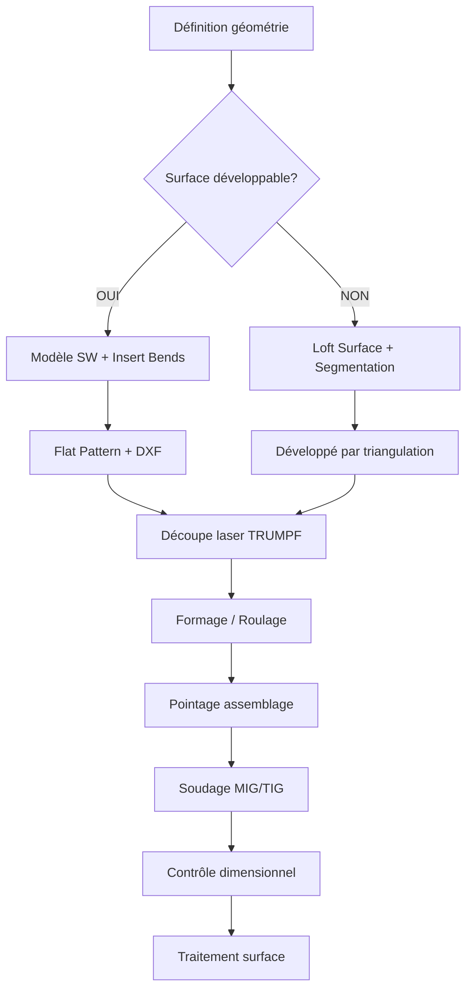

# Chaudronnerie Industrielle dans SolidWorks

> **Niveau** : Ingénieur · **Domaine** : Chaudronnerie · **CTM Industrie**

---

## 1. Définition et Spécificités

La chaudronnerie industrielle traite les **pièces épaisses** (6–30 mm) et les **formes complexes** (viroles, cônes, fonds bombés, transitions). Contrairement à la tôlerie fine, les pièces sont assemblées par soudage et non par pliage mécanique.

### Surfaces développables vs non développables

```
DÉVELOPPABLES (dépliables exactement)    NON DÉVELOPPABLES (approximation)
┌─────────────────────────────┐          ┌────────────────────────────┐
│  Cylindre ✓                 │          │  Sphère ✗                  │
│  Cône ✓                     │          │  Fond torisphérique ✗      │
│  Plan ✓                     │          │  Fond elliptique ✗         │
│  Prismes ✓                  │          │  Double courbure ✗         │
└─────────────────────────────┘          └────────────────────────────┘
```

---

## 2. Viroles (Cylindres)

### Méthode SolidWorks
1. **Esquisser** le rectangle développé : `L = π × D_ext` (longueur), `H` (hauteur)
2. **Base-Flange** avec l'épaisseur souhaitée
3. **Rolled** : Insert → Sheet Metal → Sketched Bend ou utiliser un **Loft** cylindrique
4. Méthode alternative : **Revolved Boss** + **Insert Bends** (meilleure pour visualisation)

### Développé cylindre
$$L_{développé} = \pi \times D_{moyen} = \pi \times (D_{ext} - T)$$

**Exemple** : Virole Ø500 ext, ép. 6 mm, H=300 mm
```
D_moyen = 500 - 6 = 494 mm
L_dev = π × 494 = 1552,2 mm
Soudure longitudinale : 1 cordon sur toute la hauteur
Format requis : 1555 × 305 mm (+ 2,5 mm de surépaisseur de soudure)
```

---

## 3. Cônes

### Types de cônes
- **Cône droit** : axe de symétrie perpendiculaire à la base
- **Cône oblique** : axe incliné — développé non symétrique
- **Cône tronqué** : deux bases circulaires parallèles

### Développé du cône droit tronqué
$$L_{génératrice} = \sqrt{h^2 + (R_1 - R_2)^2}$$
$$\theta_{développé} = 360° \times \frac{R_1}{L_{génératrice}}$$

```
         R1
    ┌────┴────┐
    │  grand  │  L_gen
    │  cercle │
    └────┬────┘
         R2 (petit cercle)
         h
```

### Méthode SolidWorks cône
1. Esquisser le profil (triangle avec les deux rayons et hauteur)
2. **Revolved Boss/Base** autour de l'axe
3. **Insert → Sheet Metal → Insert Bends** face extérieure
4. Le flat pattern SolidWorks calcule automatiquement le développé sectoriel

> 💡 Pour les grands cônes de chaudronnerie (D > 1500 mm), exporter le développé en DXF et recalculer manuellement les dimensions pour le tracé sur tôle.

---

## 4. Fonds Bombés

### Types normalisés
| Type | Norme | Profil | Utilisation |
|------|-------|--------|-------------|
| Torosphérique | EN 10253 | r=0,1D, R=D | Récipients pression < 40 bar |
| Semi-elliptique | ASME VIII | a/b = 2 | Pression standard |
| Hémisphérique | EN 13445 | R = D/2 | Haute pression |
| Plat | - | Plan | Faible pression, accès |
| Conique | - | α ≥ 60° | Trémies, silos |

### Modélisation fond torosphérique (SolidWorks)
1. Esquisser le profil 2D (arc R + congé r)
2. **Revolved Boss** sur l'axe
3. Pas de déplié possible → fabrication par **emboutissage** ou **segmentation**

---

## 5. Transitions Rectangle → Rond

Piece la plus complexe en chaudronnerie. La surface est **non développable** — nécessite une **segmentation**.

### Méthode par triangulation (tracé tôlier)

```
Carré 300×300 → Cercle Ø300
           ┌──────┐
           │      │
    ───────┤      ├───────
           │      │
           └──┬───┘
              │ transition
           ┌──┴───┐
           │ Ø300 │
           └──────┘
```

### Méthode SolidWorks — Loft Surface
1. **Esquisser** la section rectangulaire sur un plan
2. **Esquisser** la section circulaire sur un autre plan (à la hauteur H)
3. **Insert → Surface → Loft**
4. **Épaisseur** : Surface → Thicken (ou offset surface)
5. Segmenter en 4 secteurs (symétrie) → 4 pièces développées approximativement

> ⚠️ SolidWorks génère une approximation de la surface. Contrôler la planéité de chaque segment découpé — tolérance ≤ 2 mm sur 500 mm.

---

## 6. Segmentation et Assemblage

Pour les grandes pièces non développables, la stratégie est :
1. **Découper** la surface en triangles ou bandes développables
2. **Développer** chaque segment séparément
3. **Découper** les segments au laser
4. **Assembler** par soudage continu

### Règle de segmentation
- Angle maximal entre segments adjacents : **15°**
- Plus l'angle est petit, plus la surface est fidèle à la forme théorique
- En pratique : **8–12 segments** suffisent pour la plupart des transitions

---

## 7. Workflow Chaudronnerie CTM



---

## 8. Contraintes de Fabrication

| Contrainte | Valeur | Justification |
|------------|--------|---------------|
| Épaisseur min soudable | 3 mm | En dessous : risque de brûlure |
| Épaisseur max roulage | 20 mm (rayon D>500) | Capacité rouleuse CTM |
| Planéité tolérée | 2 mm/m | Norme EN 1090 |
| Soudure longitudinale virole | 1 passe + 1 reprise | Accès intérieur si D>300 mm |

---

## 9. Cas Réel CTM — Trémie conique AREVA

**Spécifications** : Trémie collecte, bas conique α=60°, S235 ép. 4 mm, DN500→DN200  
**Méthode** : Cône tronqué développable  
```
R1=250, R2=100, h=350
L_gen = √(350² + (250-100)²) = √(122500 + 22500) = √145000 = 380,8 mm
θ = 360° × 250/380,8 = 236,2°
```
**DXF** : Secteur de 236,2°, R_ext=380,8 mm, R_int=152,3 mm  
**Résultat** : Découpe laser en 2 demi-coques → roulage → soudage longitudinal

---

## 10. Références

- EN 13445 : Récipients sous pression non soumis à flamme
- EN 10253 : Raccords et accessoires en acier
- CODAP 2010 : Code de construction des appareils à pression
- NF EN ISO 9692-1 : Préparation des joints soudés
