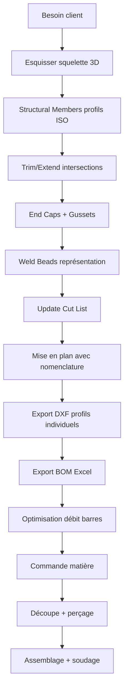

# Structures Soudées (Weldments) dans SolidWorks

> **Niveau** : Ingénieur · **Domaine** : Structures métalliques · **CTM Industrie**

---

## 1. Concept Weldments

Le module **Weldments** (Structures soudées) permet de modéliser des ossatures métalliques à partir d'un **squelette 3D** et d'une **bibliothèque de profils normalisés**.

```
Esquisse 3D (lignes)
      │
      ▼
┌─────────────────────────────────┐
│  Structural Member              │
│  Profil : IPE 200               │
│  Standard : ISO                 │
│  Trim/Extend : automatique      │
└─────────────────────────────────┘
      │
      ▼
Cut List → BOM → Plan atelier
```

---

## 2. Activation et Paramétrage

### Étape 1 — Activer Weldments
- **Insert → Weldments → Weldment** (ou cliquer l'icône dans la barre Weldments)
- Le dossier "Cut List" apparaît dans le Feature Manager

### Étape 2 — Créer le squelette 3D
1. **Insert → 3D Sketch** (ou touche de raccourci S)
2. Dessiner le squelette avec des lignes 3D
3. Utiliser les relations **Along X/Y/Z** pour contrôler les orientations
4. Les points d'intersection deviendront automatiquement des jonctions de profils

> 💡 Travailler plan par plan si possible : faire d'abord le plan de base, puis les poteaux verticaux. Cela simplifie les relations géométriques.

---

## 3. Bibliothèques de Profils ISO

### Chemin par défaut SolidWorks
```
C:\SolidWorks Data\lang\french\weldment profiles\ISO\
├── angle bar\       → cornières L
├── c channel\       → UPN
├── rectangular tube\→ RHS / SHS
├── square tube\     → SHS
└── pipe\            → tubes ronds
```

### Profils normalisés disponibles
| Catégorie | Profils | Norme |
|-----------|---------|-------|
| Poutrelles H | HEA, HEB, HEM | EN 10034 |
| Poutrelles I | IPE | EN 10034 |
| Cornières | L (égales, inégales) | EN 10056 |
| Canaux | UPN, UPE | EN 10279 |
| Tubes carrés | SHS | EN 10210/10219 |
| Tubes rectangulaires | RHS | EN 10210/10219 |
| Tubes ronds | CHS | EN 10210 |
| Barres plates | Flat | EN 10058 |

### Ajouter un profil CTM personnalisé
```
1. Créer une esquisse 2D du profil (dans un nouveau fichier .sldlfp)
2. Coter le profil et ajouter des points de référence (origine = centroïde)
3. Sauvegarder dans : ...\weldment profiles\CTM-Custom\type\
4. Nommer le fichier : dimension.SLDLFP (ex : 120x80x4.SLDLFP)
5. Disponible immédiatement dans Structural Member
```

---

## 4. Structural Member — Paramètres

Lors de l'insertion d'un Structural Member :
- **Standard** : ISO (France), ANSI (USA), DIN (Allemagne)
- **Type** : square tube, c channel, etc.
- **Taille** : dimension normalisée (ex : 100 × 100 × 4)
- **Groupes** : segments coaxiaux (même profil, même axe)
- **Rotation** : angle de rotation du profil sur l'axe
- **Mirror** : symétrie du profil
- **Point d'alignement** : choix de l'origine sur le profil (coin, centroïde, etc.)

---

## 5. Trim/Extend — Gestion des Intersections

### Règles de coupe automatique
SolidWorks offre 3 options de coupe aux intersections :

```
Option 1 : End Butt 1 (Coupe droite)
    ──────────────────────────────
              │
              │   ← coupé à l'extérieur
              │

Option 2 : End Miter (Onglet 45°)
    ──────────────────────────────
             ╱│
            ╱ │   ← onglet
           ╱  │

Option 3 : End Butt 2 (Coupe ras)
    ──────────────────────────────
              │   ← coupé à l'intérieur
              │
```

> 💡 **Règle CTM** : Utiliser **End Butt 1** par défaut (plus simple à souder). L'onglet est esthétique mais complexifie la découpe et l'assemblage.

---

## 6. End Cap, Gusset, Weld Bead

### End Cap (Bouchon)
Ferme l'extrémité d'un profil creux.
- Épaisseur typique : égale à l'épaisseur du profil ou +50%
- Option "Inset" : bouchon décalé vers l'intérieur (soudure accessible)

### Gusset (Gousset)
Raidisseur triangulaire entre deux membres perpendiculaires.
- Paramètres : d1, d2 (cathètes), épaisseur, profil (flat ou biseauté)
- Utilisation : nœuds de charpente, renforts poteau/poutre

```
    Poteau vertical
         │
         │  ╲
         │   ╲  ← gousset
         │    ╲
─────────┴─────╲─────── Poutre horizontale
```

### Weld Bead (Cordon de soudure)
Feature de représentation des cordons de soudure.
- Types : angle, bord, bouchon
- Taille du cordon : 5–10 mm typique pour structures CTM
- Apparaît dans la BOM avec masse estimée

---

## 7. Cut List (Liste de Coupe)

La Cut List est générée automatiquement et regroupe les membres identiques.

### Propriétés personnalisées Cut List CTM
```
Propriétés à configurer (clic droit sur item → Propriétés) :
├── DESCRIPTION     → "IPE 200 × 3500"
├── MATERIAL        → "S235 JR"
├── FINISH          → "Primaire époxy"
├── REFERENCE       → "CTM-2024-001-P01"
└── MASS            → automatique (lié à la masse SW)
```

### Mise à jour automatique
Après modification du modèle : **Clic droit sur "Cut List" → Update**

> ⚠️ La Cut List n'est pas automatiquement à jour si les profils sont modifiés sans rebuild. Toujours vérifier avant export de la BOM.

---

## 8. Workflow Complet Structure CTM



---

## 9. Cas Réel CTM — Portique de Levage

**Spécifications** : Portique 3T, portée 6 m, hauteur sous poutre 3 m  
**Matériaux** : S355 (structure), S235 (contreventements)  
**Profils** :
```
Poutres principales : HEA 200 (L=6000 mm × 2)
Poteaux :            HEB 160 (L=3000 mm × 4)
Croix de Saint-André : RHS 60×40×3 (L≈4243 mm × 4)
Platines pied :      Flat 200×200×12 mm × 4
```

**Cut List automatique** : 14 lignes, masse totale calculée = 387 kg  
**Découpe** : Sciage + perçage CNC sur profils 6 m  

---

## 10. Références

- EN 1090-2 : Exécution des structures en acier
- EN 10025-2 : Aciers de construction (S235, S355)
- EN 10034 : Profils HE, IPE
- SolidWorks 2025 Help : Weldments, Structural Member, Cut List
