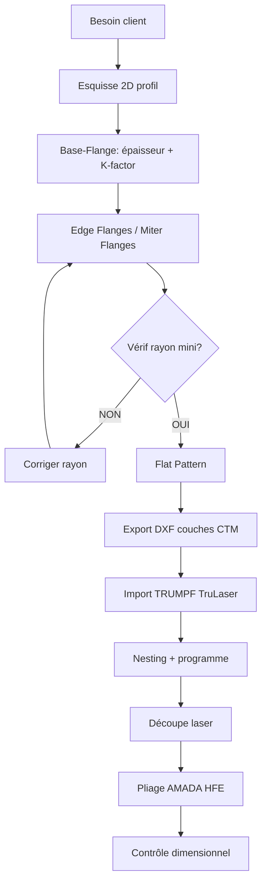

# Bases de la Tôlerie Industrielle dans SolidWorks

> **Niveau** : Ingénieur · **Domaine** : Tôlerie · **CTM Industrie — Normandie**

---

## 1. Définition et Modèle Mental

La tôlerie est la mise en forme de tôles minces (0,5–12 mm) par **découpe** et **pliage**. SolidWorks modélise chaque pièce comme une **surface développable** — elle peut être dépliée mathématiquement en un seul plan plat.

```
Tôle brute 3D
     │
     ▼
┌──────────────────────────────┐
│  Feature Sheet Metal         │
│  ┌──────┐  ┌──────┐         │
│  │Bride1│  │Bride2│         │
│  └──┬───┘  └──┬───┘         │
│     └────┬────┘              │
│        Pli                   │
└──────────────────────────────┘
     │
     ▼
Flat Pattern → DXF → TRUMPF TruLaser
```

---

## 2. Activation du Module Sheet Metal

### Méthode 1 — Feature Base-Flange
1. Nouveau fichier pièce (template CTM `ctm_piece.prtdot`)
2. Esquisse du profil de la pièce
3. **Insert → Sheet Metal → Base Flange/Tab**
4. Saisir : Épaisseur, K-factor, Rayon de pli par défaut

### Méthode 2 — Insert Bends (pièce solide existante)
1. Modèle solide créé normalement
2. **Insert → Sheet Metal → Insert Bends**
3. Sélectionner la face fixe (face de référence)
4. SolidWorks crée automatiquement les features de pliage

> 💡 **Astuce CTM** : Toujours partir de la méthode Base-Flange pour les nouvelles pièces. La méthode Insert Bends génère parfois des erreurs de déplié sur les géométries complexes.

---

## 3. Table des K-Factors CTM

Le **K-factor** positionne l'axe neutre dans l'épaisseur :  
`K = t / T` où `t` = distance axe neutre / face intérieure, `T` = épaisseur totale.

| Matériau | 0,5–1,5 mm | 1,5–3,0 mm | 3,0–6,0 mm | 6,0–12,0 mm |
|----------|------------|------------|------------|-------------|
| **S235** | 0,38 | 0,40 | 0,42 | 0,44 |
| **S355** | 0,40 | 0,42 | 0,44 | 0,46 |
| **Inox 304L** | 0,35 | 0,37 | 0,40 | 0,42 |
| **Inox 316L** | 0,35 | 0,37 | 0,40 | 0,42 |
| **Alu 5754** | 0,41 | 0,43 | 0,45 | 0,47 |

*Source : tables AMADA HFE 100-30 + EN 10130*

---

## 4. Rayons de Pli Minimum

| Matériau | R_min (× épaisseur) | Exemple ép. 3 mm |
|----------|---------------------|------------------|
| S235 | 0,8 × T | 2,4 mm |
| S355 | 1,0 × T | 3,0 mm |
| Inox 304/316L | 1,2 × T | 3,6 mm |
| Alu 5754 | 1,5 × T | 4,5 mm |

> ⚠️ **Erreur fréquente** : Utiliser le même rayon pour l'inox et l'acier doux. L'inox est moins ductile — rayon 50 % plus grand minimum.

---

## 5. Features Sheet Metal Essentielles

### 5.1 Base-Flange / Tab
Première feature — crée la tôle de base depuis une esquisse.
- **Paramètres clés** : Épaisseur, direction, K-factor, rayon par défaut
- Peut être une extrusion (profil 2D) ou une tôle plane (fermée)

### 5.2 Edge Flange
Plie une bride sur un bord existant.
```
Options importantes :
├── Longueur bride (L)
├── Angle (90° standard, ajustable)
├── Position matière (Inside / Outside / Bend Outside)
└── Profil personnalisé (esquisse sur bord)
```

**Règle longueur bride minimum** : `L_min = 2 × T + R`

### 5.3 Miter Flange
Bride continues sur plusieurs bords avec joint d'onglet. Idéal pour les bords en L ou en U.
- Paramètre **Gap** : jeu d'onglet (0,5–1 mm recommandé pour S235)

### 5.4 Hem (Ourlet)
Repli du bord pour rigidification ou protection. Types : Open, Closed, Teardrop, Rolled.

### 5.5 Jog (Décalage)
Décalage d'une face par rapport au plan de base. Utilisé pour les recouvrements.

### 5.6 Lofted Bend
Transition entre deux profils d'esquisse. Génère une surface gauche (approximation). **Fabrication par segmentation** nécessaire.

---

## 6. Flat Pattern (Déplié)

### Activation
- **Insérer → Tôlerie → Déplié**
- Ou cliquer sur l'icône "Flat Pattern" dans la barre Sheet Metal

### Paramètres DXF pour TRUMPF TruLaser 3030
```
Couches DXF recommandées CTM :
├── DECOUPE          → contour extérieur
├── PLIS_MONTANT     → lignes de pli vers le haut
├── PLIS_DESCENDANT  → lignes de pli vers le bas
├── GRAVURE          → textes, repères
└── FORME_EMBOUTI    → features formées
```

> 💡 **Astuce** : Configurer les couches DXF une fois dans **Outils → Options → Paramètres Système → Exportation → DXF/DWG**. Sauvegarder le profil "CTM-TRUMPF".

---

## 7. Workflow Complet CTM



---

## 8. Erreurs Fréquentes et Solutions

| Erreur | Cause | Solution |
|--------|-------|----------|
| "Impossible de déplier" | Géométrie non développable | Vérifier qu'aucune face n'est gauche |
| K-factor ignoré | Table de pliage active | Désactiver la table ou l'aligner |
| DXF sans lignes de pli | Option non cochée | Export → inclure les lignes d'esquisse |
| Rayon ≠ dans atelier | K-factor modèle ≠ table plieuse | Aligner les tables AMADA dans SW |
| Bride trop courte | L < 2×T | Augmenter la longueur bride |

---

## 9. Cas Réel CTM — Capot machine EDF

**Contexte** : Capot de protection IP54 pour transformateur, S235 ép. 2 mm, 400×300×200 mm  
**Défis** : 4 brides à 90°, 2 découpes circulaires Ø120, finition poudre  

**Solution** :
1. Base-Flange 400×300 ép. 2 mm, K=0,40
2. 4× Edge Flange 200 mm, angle 90°, Material Inside
3. Discover Ø120 par Extruded Cut sur Flat Pattern
4. DXF généré avec couches CTM → TRUMPF

**Résultat** : Développé 720×640 mm — 1 chute < 5%

---

## 10. Références

- EN 10130 : Tôles laminées à froid pour formage
- EN ISO 2768 : Tolérances générales
- AMADA HFE 100-30 : Manuel outillage pliage
- SolidWorks 2025 Help : Sheet Metal Feature
